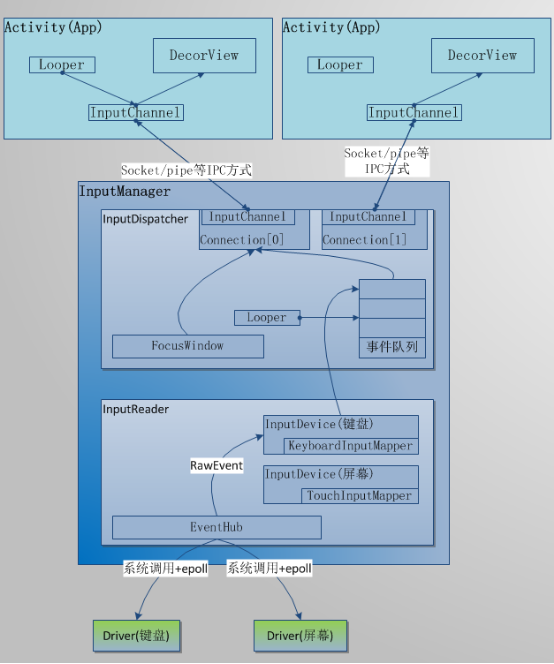

# Android输入系统

从宏观的角度上来讲，输入事件是由输入设备产生的，经过系统的分发，最终到达App中进行处理。就好比我们平时邮寄包裹，当我们打算寄出一个包裹，就相当于产生了一个事件，随后快递小哥把包裹从我们这取走，并且在包裹上填写上相应的信息，然后将包裹运送到中转部，中转部在根据实际的需要，将包裹分发到目的地，最后接收者就能够拿到包裹了。Android输入系统的原理和寄包裹类似。如下就是一个输入事件在Android系统的分发线路。

1.  InputReader负责从驱动读取事件，并且根据事件的类型，对事件做一些基本的加工，比如将从驱动读取的键盘读取的原始code转化为keyCode等。将加工过的事件放入到上层InputDispatcher的事件队列中，并且唤醒事件分发线程。这里的InputReader运行在一个独立的线程，能够保证事件被很快的读取，不受事件分发的影响。
2.  InputDispatcher被唤醒后，从事件队列中取出一个事件，接下来找到FocusWindow，这样就明确了这个事件将要分发的目标。由于App和InputManager在不同的进程中，所以需要采用socket、pipe、共享内存等进程间通信的方式，将事件通知给目标进程。
3.  目标进程通过对socket、pipe的监控，得知事件的到来，然后从socket、pipe中读取到事件信息，最后就可以将事件分发给根View，根View通过递归的的方式，找到最终要消费该事件的view，交给该view去消费。

到目前为止，整个Android的输入事件基本处理完毕。相信大家对Android的输入系统有了一个整体的认识，接下来从源码的角度分析各个模块具体是怎么工作的，以及模块间的通信方式以及协议制订。

### 输入系统的启动与初始化
### InputReader读取事件
### InputDispatcher分发事件
### App端处理事件
